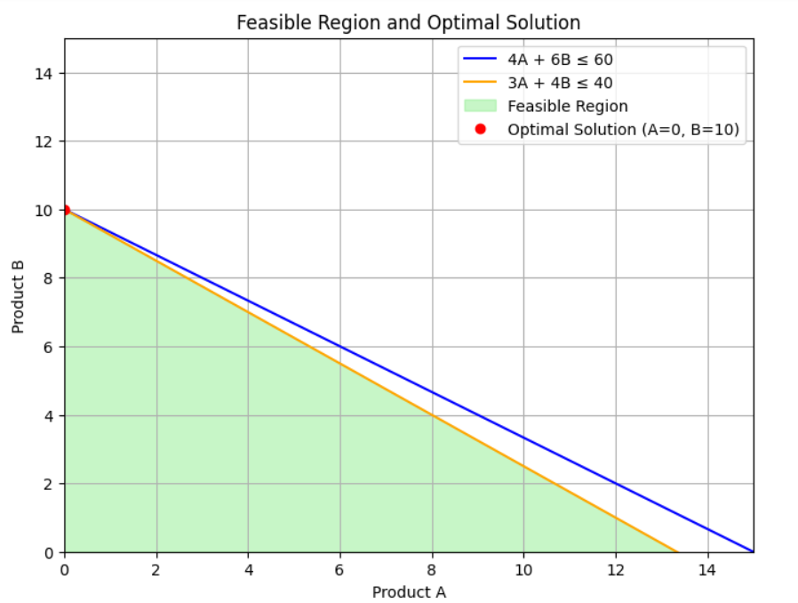

# Task 4: Business Optimization using Linear Programming

## Objective
Solve a real-world business problem using Linear Programming to maximize profit using Python's PuLP library.

## Problem Statement
A company manufactures two products (A & B). Each requires labor and materials. Maximize profit given constraints on resources.

## Mathematical Formulation
- Maximize: 20A + 30B
- Subject to:
  - 4A + 6B ≤ 60 (Labor hours)
  - 3A + 4B ≤ 40 (Material units)
  - A, B ≥ 0 and integers

## Code Implementation
- PuLP library to model and solve LP
- Extract optimal product quantities and profit

## Tools & Libraries
- PuLP
- Python (Google Collab Notebook)

## Output
- Optimal units to produce: A = 0, B = 10
- Maximum Profit = $300
()

## Conclusion
Successfully implemented an LP model to optimize business production strategy with given constraints.
